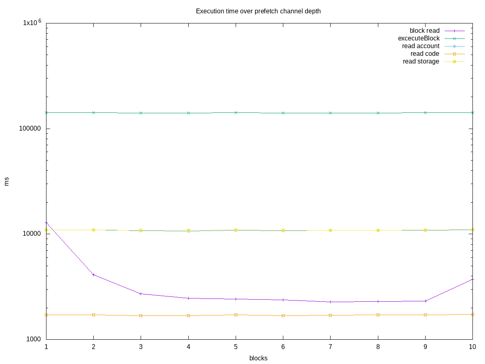

# Execution time over prefetch channel depth

## **block read** (with prefetch)
marks:  1-  0
loops: 10000
Depth | Total us
------|----------
0 + 1 |  12845643
1 + 1 |   4097224
2 + 1 |   2724695
3 + 1 |   2467473
4 + 1 |   2426979
5 + 1 |   2377742
6 + 1 |   2280972
7 + 1 |   2304338
8 + 1 |   2322299
9 + 1 |   3714942

## is stopped?
marks:  2-  1
loops: 10000
Depth | Total us
------|----------
0 + 1 |      2420
1 + 1 |      2714
2 + 1 |      2765
3 + 1 |      2952
4 + 1 |      2247
5 + 1 |      3259
6 + 1 |      2460
7 + 1 |      2679
8 + 1 |      2070
9 + 1 |      2391

## transactions length
marks:  3-  2
loops: 10000
Depth | Total us
------|----------
0 + 1 |      2278
1 + 1 |      2134
2 + 1 |      2028
3 + 1 |      2060
4 + 1 |      2059
5 + 1 |      2006
6 + 1 |      2031
7 + 1 |      1941
8 + 1 |      2010
9 + 1 |      2010

## **excecuteBlock**
marks:  4-  3
loops: 10000
Depth | Total us
------|----------
0 + 1 | 141505747
1 + 1 | 142086876
2 + 1 | 141014639
3 + 1 | 140379492
4 + 1 | 141351524
5 + 1 | 140383475
6 + 1 | 141299028
7 + 1 | 141303571
8 + 1 | 141579641
9 + 1 | 142329000

## add gas
marks:  5-  4
loops: 10000
Depth | Total us
------|----------
0 + 1 |      1298
1 + 1 |      1306
2 + 1 |      1231
3 + 1 |      1302
4 + 1 |      1448
5 + 1 |      1200
6 + 1 |      1269
7 + 1 |      1312
8 + 1 |      1279
9 + 1 |      1504

## stateObject cached?
marks: 11- 10
loops: 38654000
Depth | Total us
------|----------
0 + 1 |   3321635
1 + 1 |   3345067
2 + 1 |   3308608
3 + 1 |   3302818
4 + 1 |   3307748
5 + 1 |   3287885
6 + 1 |   3345722
7 + 1 |   3325678
8 + 1 |   3302655
9 + 1 |   3320103

## **read account** (with prefetch)
marks: 13- 12
loops: 1824923
Depth | Total us
------|----------
0 + 1 |  10922720
1 + 1 |  10924194
2 + 1 |  10797863
3 + 1 |  10713277
4 + 1 |  10880356
5 + 1 |  10758706
6 + 1 |  10819407
7 + 1 |  10827621
8 + 1 |  10815285
9 + 1 |  11003068

## add stateObject
marks: 15- 14
loops: 1701345
Depth | Total us
------|----------
0 + 1 |   1061483
1 + 1 |   1079680
2 + 1 |   1071514
3 + 1 |   1062523
4 + 1 |   1068432
5 + 1 |   1063095
6 + 1 |   1071195
7 + 1 |   1064923
8 + 1 |   1077395
9 + 1 |   1069868

## code cached?
marks: 21- 20
loops: 2258116
Depth | Total us
------|----------
0 + 1 |    142058
1 + 1 |    142036
2 + 1 |    153338
3 + 1 |    142757
4 + 1 |    142402
5 + 1 |    139359
6 + 1 |    141915
7 + 1 |    140363
8 + 1 |    142130
9 + 1 |    141645

## **read code** (with prefetch)
marks: 23- 22
loops: 613418
Depth | Total us
------|----------
0 + 1 |   1713743
1 + 1 |   1719329
2 + 1 |   1688968
3 + 1 |   1682472
4 + 1 |   1720245
5 + 1 |   1685343
6 + 1 |   1704043
7 + 1 |   1707572
8 + 1 |   1715047
9 + 1 |   1724963

## storage dirty?
marks: 31- 30
loops: 18058060
Depth | Total us
------|----------
0 + 1 |   1378697
1 + 1 |   1400035
2 + 1 |   1395415
3 + 1 |   1369592
4 + 1 |   1375248
5 + 1 |   1366702
6 + 1 |   1372210
7 + 1 |   1398231
8 + 1 |   1375465
9 + 1 |   1398837

## storage cached?
marks: 33- 32
loops: 14554890
Depth | Total us
------|----------
0 + 1 |   1296904
1 + 1 |   1335585
2 + 1 |   1287911
3 + 1 |   1290723
4 + 1 |   1298880
5 + 1 |   1297978
6 + 1 |   1289344
7 + 1 |   1331238
8 + 1 |   1316876
9 + 1 |   1299287

## **read storage** (with known prefetch)
marks: 35- 34
loops: 4345470
Depth | Total us
------|----------
0 + 1 |  10948753
1 + 1 |  10922224
2 + 1 |  10901569
3 + 1 |  10822525
4 + 1 |  10916370
5 + 1 |  10833665
6 + 1 |  10904089
7 + 1 |  10863794
8 + 1 |  10991957
9 + 1 |  11006376

## output to int256
marks: 37- 36
loops: 4345470
Depth | Total us
------|----------
0 + 1 |    438217
1 + 1 |    438168
2 + 1 |    434939
3 + 1 |    436847
4 + 1 |    439558
5 + 1 |    433134
6 + 1 |    433007
7 + 1 |    436687
8 + 1 |    435218
9 + 1 |    436615

## save to cache
marks: 38- 37
loops: 4345470
Depth | Total us
------|----------
0 + 1 |   1503236
1 + 1 |   1508817
2 + 1 |   1467414
3 + 1 |   1493275
4 + 1 |   1503903
5 + 1 |   1501969
6 + 1 |   1493753
7 + 1 |   1512475
8 + 1 |   1498437
9 + 1 |   1505944
